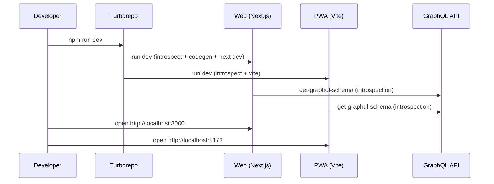
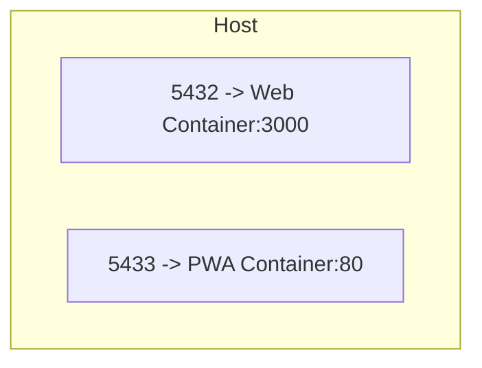

# KHP Front — Frontend Monorepo

A [Turborepo](https://turbo.build) monorepo with two apps (Web and PWA) and several shared packages.

## Repository Structure

- `apps/web` — [Next.js](https://nextjs.org/) web application
- `apps/pwa` — [Vite + React](https://vitejs.dev/) Progressive Web App
- `packages/ui` — shared React UI library (light design system)
- `packages/eslint-config` — shared ESLint configuration
- `packages/typescript-config` — shared TypeScript configurations
- `packages/graphql` — shared GraphQL artifacts (optional)

All projects use TypeScript and common tooling.

## Architecture

```mermaid
flowchart LR
  subgraph Apps
    Web[Next.js Web App<br/>apps/web]
    PWA[Vite + React PWA<br/>apps/pwa]
  end

  subgraph Shared Packages
    UI[@workspace/ui<br/>React UI Library]
    ESLint[@workspace/eslint-config]
    TS[@workspace/typescript-config]
    GQL[packages/graphql<br/>Shared artifacts]
  end

  Backend[(GraphQL API<br/>https://back.goofykhp.fr/graphql)]

  Web --> UI
  Web --> ESLint
  Web --> TS
  PWA --> UI
  PWA --> ESLint
  PWA --> TS
  UI --> ESLint
  UI --> TS
  Web --> Backend
  PWA --> Backend
```

### Development Flow



## Requirements

- Node.js >= 18 (repo uses `npm@11`)
- Network access to fetch the GraphQL schema on first run
- Docker (optional) to build runtime images

## Setup

```bash
npm install
```

## Environment Variables

- `apps/web` — create `.env` (see `.env.example`):
  - `NEXT_PUBLIC_API_URL` (e.g. `http://localhost:8000`)
- `apps/pwa` — `.env` expected:
  - `VITE_API_URL` (e.g. `http://localhost:8000`)
  - `VITE_PROJECT_NAME` (e.g. `KHP-front`)

## Development

Start everything with Turborepo:

```bash
npm run dev
```

Run a specific app:

```bash
npm run dev:web   # Next.js
npm run dev:pwa   # Vite (host exposed)
```

By default, Web runs at `http://localhost:3000` and PWA at `http://localhost:5173`.
On first run, both apps introspect `https://back.goofykhp.fr/graphql` to update their local schema files.

## Build & Quality

- `npm run build` — build all apps and packages
- `npm run build:web` / `npm run build:pwa` — targeted builds
- `npm run lint` — lint the entire workspace
- `npm run check-types` — TypeScript checks
- `npm run format` — Prettier (`*.ts, *.tsx, *.md`)

## Docker (optional)

Dockerfiles are provided for both apps. The `Makefile` includes shortcuts:

```bash
# Build and start both apps
make build-and-start

# Web only
make build-web
make start-web   # maps host 5432 -> container 3000

# PWA only
make build-pwa
make start-pwa   # maps host 5433 -> container 80
```

### Runtime Topology



## Conventions

- Git hooks managed by [Lefthook](https://github.com/evilmartians/lefthook):

```bash
npx lefthook install
```

- Commit format: `[KHP-123] feat(scope): message` enforced by `verify-commit-msg.sh`.

## Per-Project Docs

- `apps/web` — see `apps/web/README.md`
- `apps/pwa` — see `apps/pwa/README.md`
- `packages/ui` — see `packages/ui/README.md`
- `packages/eslint-config` — see `packages/eslint-config/README.md`
- `packages/typescript-config` — see `packages/typescript-config/README.md`
- `packages/graphql` — see `packages/graphql/README.md`
