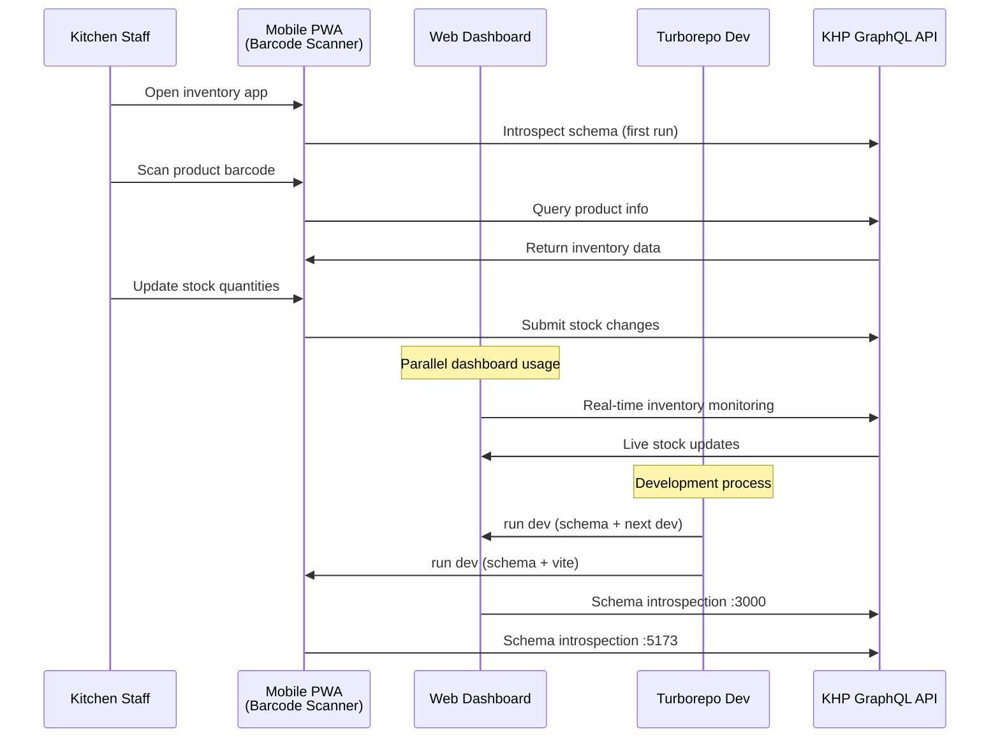
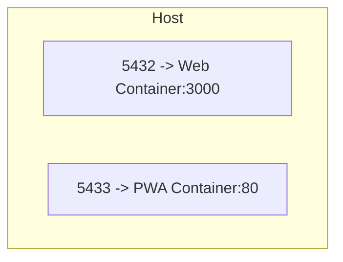

# KHP Front — Kitchen Inventory Management System

A [Turborepo](https://turbo.build) monorepo for **KHP** (Kitchen Hospitality Platform) - a comprehensive inventory management system designed for restaurants and commercial kitchens. Features web dashboard and mobile PWA with barcode scanning capabilities.

## Repository Structure

- `apps/web` — [Next.js](https://nextjs.org/) web dashboard for inventory management (desktop/tablet)
- `apps/pwa` — [Vite + React](https://vitejs.dev/) Progressive Web App with barcode scanning (mobile-first)
- `packages/ui` — shared React UI library with kitchen-specific components
- `packages/eslint-config` — shared ESLint configuration
- `packages/typescript-config` — shared TypeScript configurations
- `packages/graphql` — shared GraphQL artifacts and schema introspection

Both apps connect to the KHP GraphQL API for real-time inventory tracking, ingredient management, stock monitoring, and barcode-based product identification.

## Architecture

```mermaid
flowchart LR
  subgraph Apps["KHP Applications"]
    Web[Next.js Web Dashboard<br/>Desktop/Tablet Interface<br/>apps/web]
    PWA[Vite + React PWA<br/>Mobile Barcode Scanner<br/>apps/pwa]
  end

  subgraph Shared Packages
    UI[&#64;workspace/ui<br/>Kitchen UI Components]
    ESLint[&#64;workspace/eslint-config]
    TS[&#64;workspace/typescript-config]
    GQL[packages/graphql<br/>Schema & Introspection]
  end

  Backend[(KHP GraphQL API<br/>https://back.goofykhp.fr/graphql<br/>Inventory & Product Data)]

  Web --> UI
  Web --> ESLint
  Web --> TS
  PWA --> UI
  PWA --> ESLint
  PWA --> TS
  UI --> ESLint
  UI --> TS
  Web --> Backend
  PWA --> Backend
```



### Development Flow



## Requirements

- **Node.js >= 18** (project uses `npm@11.3.0`)
- **Network access** to KHP GraphQL API (`https://back.goofykhp.fr/graphql`) for schema introspection
- **Camera/Barcode scanner** support for mobile PWA (optional but recommended)
- **Docker** (optional) for containerized deployments

## Setup

```bash
npm install
```

## Environment Variables

### Web Dashboard (`apps/web`)
Create `.env` file (see `.env.example`):
```env
NEXT_PUBLIC_API_URL=https://back.goofykhp.fr/graphql
# For local development: http://localhost:8000/graphql
```

### Mobile PWA (`apps/pwa`)  
`.env` file required:
```env
VITE_API_URL=https://back.goofykhp.fr/graphql
VITE_PROJECT_NAME=KHP-front
# For local development: VITE_API_URL=http://localhost:8000/graphql
```

**Note**: Both apps automatically introspect the GraphQL schema from `https://back.goofykhp.fr/graphql` during development and build processes.

## Development

### Quick Start
Start both applications with Turborepo:

```bash
npm run dev
```

### Individual Applications

**Web Dashboard** (desktop/tablet interface):
```bash
npm run dev:web   # → http://localhost:3000
```

**Mobile PWA** (barcode scanner):
```bash
npm run dev:pwa   # → http://localhost:5173 (network exposed)
```

### First Run Setup
On initial startup, both applications will:
1. **Introspect** the KHP GraphQL API schema from `https://back.goofykhp.fr/graphql`
2. **Generate** TypeScript types and GraphQL operations
3. **Start** the development servers

**Note**: Ensure network connectivity to the KHP API for schema introspection.

## Build & Quality

### Build Commands
- `npm run build` — build all applications and packages
- `npm run build:web` — build web dashboard only  
- `npm run build:pwa` — build mobile PWA only

### Code Quality
- `npm run lint` — lint the entire workspace
- `npm run check-types` — TypeScript type checking
- `npm run format` — format code with Prettier (`*.ts, *.tsx, *.md`)

### Testing
- Individual apps support `npm run test`, `npm run test:watch`, `npm run test:run`
- Run from workspace root or navigate to specific app directories

## Docker Deployment

Production-ready Dockerfiles are provided for both applications. Use the included `Makefile` for simplified container management:

### All Applications
```bash
make build-and-start    # Build and start both containers
```

### Web Dashboard
```bash
make build-web          # Build web dashboard image
make start-web          # Start container (localhost:5432 → container:3000)
```

### Mobile PWA  
```bash
make build-pwa          # Build PWA image
make start-pwa          # Start container (localhost:5433 → container:80)
```

### Production Deployment
The CI/CD workflows automatically build and publish images to GitHub Container Registry (GHCR) on pushes to `main`:
- **Web**: `deploy_webapp` workflow
- **PWA**: `deploy_pwa` workflow

### Runtime Topology



## Development Conventions

### Git Hooks
Git hooks are managed by [Lefthook](https://github.com/evilmartians/lefthook):

```bash
npx lefthook install
```

### Commit Messages
Enforce conventional commit format: `[KHP-123] feat(scope): message`
- Validated by `verify-commit-msg.sh`
- Include ticket numbers for traceability
- Use conventional commit types: `feat`, `fix`, `docs`, `style`, `refactor`, `test`, `chore`

### Code Organization
- **Shared components**: Use `@workspace/ui` for reusable kitchen/inventory UI components
- **GraphQL**: Schema introspection and type generation handled automatically
- **TypeScript**: Strict typing enforced across all packages

## Per-Project Docs

- `apps/web` — see `apps/web/README.md`
- `apps/pwa` — see `apps/pwa/README.md`
- `packages/ui` — see `packages/ui/README.md`
- `packages/eslint-config` — see `packages/eslint-config/README.md`
- `packages/typescript-config` — see `packages/typescript-config/README.md`
- `packages/graphql` — see `packages/graphql/README.md`
